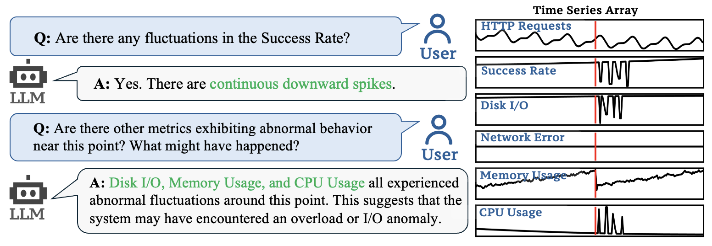

<div align="center">

# ChatTS: Understanding, Chat, Reasoning about Time Series with TS-MLLM

[](https://huggingface.co/bytedance-research/ChatTS-14B)
[](https://huggingface.co/spaces/xiezhe22/ChatTS)
[](https://doi.org/10.5281/zenodo.14349206)
[](https://arxiv.org/abs/2412.03104)


</div>

`ChatTS` is a Time Series Multimodal LLM focuses on **Understanding and Reasoning** about time series, much like what vision/video/audio-MLLMs do.
This repo provides code, datasets and model for `ChatTS` (VLDB' 25): [ChatTS: Aligning Time Series with LLMs via Synthetic Data for Enhanced Understanding and Reasoning](https://arxiv.org/pdf/2412.03104).

## Web Demo
The **Web Demo** of ChatTS-14B is available at [](https://huggingface.co/spaces/xiezhe22/ChatTS)

You can upload a `.csv` file to the Web Demo to analyze your own data (Example: [ts_example.csv](demo/ts_example.csv))

## Key Features
ChatTS is a Multimodal LLM built natively for time series as a core modality：
- ✅ **Native support for multivariate time series**
- ✅ **Flexible input**: Supports multivariate time series with **different lengths** and **flexible dimensionality**
- ✅ **Conversational understanding + reasoning**:  
  Enables interactive dialogue over time series to explore insights about time series
- ✅ **Preserves raw numerical values**:  
  Can answer **statistical questions**, such as _"How large is the spike at timestamp t?"_
- ✅ **Easy integration with existing LLM pipelines**, including support for **vLLM**.

### Example Application
Here is an example of a ChatTS application, which allows users to interact with a LLM to understand and reason about time series data:


Check out the [Case Studies](#case-studies) section for more real-world applications and sample conversations.


<!-- We also provide the evaluation datasets collected by us. You can download the evaluation datasets from [](https://doi.org/10.5281/zenodo.14349206). The training scripts can be found in [ChatTS-Training](https://github.com/xiezhe-24/ChatTS-Training).
A fine-tuned `ChatTS` model (based on a modified version of QWen2.5-14B-Instruct) have been open-sourced at [](https://huggingface.co/bytedance-research/ChatTS-14B). You can download and try it! -->

## Quick Start
- **Web Demo (New)**:
  - [(No Need to Install) Try ChatTS with the Web Demo on Huggingface Spaces](https://huggingface.co/spaces/xiezhe22/ChatTS)
- **Installation:**
  - [Step 1: Download the ChatTS-14B Model, Training and Evaluation Datasets](#resource-links)
  - [Step 2: Install the dependencies](#installation)
- **Deployment:**
  - [Option 1: Inference with Transformers](#try-the-chatts-model) (refer to [demo/demo_hf.ipynb](demo/demo_hf.ipynb))
  - [Option 2: vLLM Offline Inference](#vllm-inference) (refer to [demo/demo_vllm.py](demo/demo_vllm.py))
  - [Option 3: OpenAI API Compatible Server with vLLM](#openai-api-compatible-server)
- **Training:**
  - [Step 1: Generate Alignment and SFT Datasets](#training-data-generation)
  - [Step 2: Fine-tuning Your own Models](#fine-tuning-your-own-model)
  - [Optional: Use the TS Generator Manually](#ts-generator) (refer to [demo/demo_ts_generator.py](demo/demo_ts_generator.ipynb))
- **Evaluation:**
  - [Step 1: Generate Answers with vLLM / DeepSpeed](#step-1-vllm--deepspeed-model-inference-for-evaluation)
  - [Step 2: Evaluate the Results](#step-2-evaluate-the-results)

## News
- **2025/07/24**: A Web Demo of ChatTS is available at [](https://huggingface.co/spaces/xiezhe22/ChatTS)
- **2025/07/03**: The quantized version of ChatTS: `ChatTS-14B-GPTQ-4bit` is available at [HuggingFace](https://huggingface.co/xiezhe24/ChatTS-14B-GPTQ-Int4)!
- **2025/04/29**: The data generation code has been updated. You can generate the training datasets of `ChatTS` with the updated code now. Please refer to [Training Data Generation](#training-data-generation). We have also open-sourced the implementation for all the baseline models! Please refer to [Evaluation](#evaluation).
- **2025/04/16**: ChatTS has been accepted by VLDB '25! We have released the training datasets for ChatTS. You can also use the code in this repo to generate data manually and do the model training.
- **2025/01/01**: We have released a new version of `ChatTS` model, with enhanced CoT and question answering capability. Check [](https://huggingface.co/bytedance-research/ChatTS-14B) for more information.
- **2024/12/30**: A experimental version of `vLLM` support for ChatTS is available! Check [demo_vllm.py](demo/demo_vllm.py) for more information. (**Note**: This version is still under development and may not be stable.) We have also updated the ChatTS model implementation, which supports `kv_cache` and `AutoProcessor` now.

## Resource Links

<div align="center">

| Resource                | Link                                                                              | Description                         |
|-------------------------|-----------------------------------------------------------------------------------|-------------------------------------|
| ChatTS Paper (VLDB' 25)    | [arXiv:2412.03104](https://arxiv.org/abs/2412.03104)                              | Paper                      |
| ChatTS-14B Model            | [Hugging Face Model](https://huggingface.co/bytedance-research/ChatTS-14B)        | Model weights                       |
| ChatTS-14B-GPTQ-Int4 Model  | [Hugging Face Model](https://huggingface.co/xiezhe24/ChatTS-14B-GPTQ-Int4)        | Quantization                       |
| Training Datasets        | [Hugging Face Dataset](https://huggingface.co/datasets/ChatTSRepo/ChatTS-Training-Dataset) | Synthetic training set              |
| Evaluation Datasets     | [Zenodo](https://doi.org/10.5281/zenodo.14349206)                                 | Real & synthetic eval data          |
| Training Scripts     | [ChatTS-Training](https://github.com/xiezhe-24/ChatTS-Training)                   | Training Scripts for ChatTS                    |

</div>

## Introduction
This repository provides several toolkits for generating synthetic data with the approaches introduced in `ChatTS`, as well as the evaluation code and evaluation datasets for reproduction. 

We have provided:
- Toolkits for generating synthetic time series data and the corresponding attribues: `chatts/ts_generator/generate.py`.
- Example code for generating a training dataset with pre-defined templates: `demo/generate_template_qa.py`, which can be further used as seed QAs for TSEvol.
- Example code for generating a training dataset with LLMs: `chatts/sft/generate_llm_qa`, which can be further used as seed QAs for TSEvol.
- Code implementation for `TSEvol` with the generated seed QAs: `chatts/sft/generate_tsevol_dataset.py`.
- Code implementation for evaluation: `evaluation/`.
- Simple demos for inference: `demo/demo_hf.ipynb` and `demo/demo_vllm.py`.
- A trained `ChatTS` model (fine-tuned based on a modified version of QWen2.5-14B-Instruct) at [](https://huggingface.co/bytedance-research/ChatTS-14B).
- Training datasets: [](https://huggingface.co/datasets/ChatTSRepo/ChatTS-Training-Dataset)
- Evaluations datasets: [](https://doi.org/10.5281/zenodo.14349206).
- **Training scripts**: [ChatTS-Training](https://github.com/xiezhe-24/ChatTS-Training).

## Getting Started
### Installation
- Basic requirements for model inference: `python>=3.11`, `deepspeed`, `vllm==0.8.5`, `torch==2.6.0`, `flash-attn` (refer to `requirements.txt`).
- Download the evaluation datasets from [Zenodo](https://doi.org/10.5281/zenodo.14349206) and put them under `evaluation/dataset` (`evaluation/dataset/dataset_a.json` and `evaluation/dataset/dataset_b.json`).
- Download the trained model weights from [HuggingFace](https://huggingface.co/bytedance-research/ChatTS-14B), extract it and put all the extracted files under `ckpt/` (`ckpt/config.json`, etc).
- **Note:** `ChatTS` is trained based on a 14B-sized base model, so you need to ensure that you have a GPU with sufficient memory for inference. Additionally, due to the model's requirements, `Flash-Attention` (https://github.com/Dao-AILab/flash-attention) is essential, so you need to ensure that your GPU meets the installation requirements for Flash-Attention. Recommended GPUs: A100/A800.

### Try the ChatTS Model
- Following the steps in `Installation` to download the trained `ChatTS` model and place it under `ckpt`. 
- The ChatTS model can be loaded directly using the `transformers` library. **Refer to `demo/demo_hf.ipynb` for more information.**
- **About `sp` Encoding.** To facilitate the input of variable-length batch time series, we adopted a method named `sp` encoding when encoding the time series. For each time series data point, an additional numerical value of 1.0 is added as a mask. For convenience, we have a Processor which can be loaded with `AutoProcessor` in `transformers` to normalize and convert the time series and text (Value-Preserved Time Series Encoding). Please refer to `demo/demo_hf.ipynb` for more information about their usage. 
- An example usage of ChatTS (with `HuggingFace`):
```python
from transformers import AutoModelForCausalLM, AutoTokenizer, AutoProcessor
import torch
import numpy as np

# Load the model, tokenizer and processor
model = AutoModelForCausalLM.from_pretrained("./ckpt", trust_remote_code=True, device_map=0, torch_dtype='float16')
tokenizer = AutoTokenizer.from_pretrained("./ckpt", trust_remote_code=True)
processor = AutoProcessor.from_pretrained("./ckpt", trust_remote_code=True, tokenizer=tokenizer)
# Create time series and prompts
timeseries = np.sin(np.arange(256) / 10) * 5.0
timeseries[100:] -= 10.0
prompt = f"I have a time series length of 256: <ts><ts/>. Please analyze the local changes in this time series."
# Apply Chat Template
prompt = f"<|im_start|>system\nYou are a helpful assistant.<|im_end|><|im_start|>user\n{prompt}<|im_end|><|im_start|>assistant\n"
# Convert to tensor
inputs = processor(text=[prompt], timeseries=[timeseries], padding=True, return_tensors="pt")
# Move to GPU
inputs = {k: v.to(0) for k, v in inputs.items()}
# Model Generate
outputs = model.generate(**inputs, max_new_tokens=300)
print(tokenizer.decode(outputs[0][len(inputs['input_ids'][0]):], skip_special_tokens=True))
```
- **Note:** Due to training data limitations, the recommended time series length for ChatTS ranges from **64 to 1024**, with a maximum of **30** series in one input. Currently, time series that are too short (i.e., shorter than 64) may not be correctly recognized by ChatTS. We will improve this in future updates.

### vLLM Inference
Since [vLLM](https://github.com/vllm-project/vllm) lacks native support for the `ChatTS` model, we have provided a [patch](chatts/vllm/chatts_vllm.py) to enable vLLM to support inference. Therefore, before using vLLM to load the model, please make sure that the code includes: `import chatts.vllm.chatts_vllm` to register the ChatTS model in vLLM. Please refer to the following steps to use vLLM to load ChatTS:

1. Install `vllm==0.8.5` (please ensure that you have installed the exact version as vLLM's multimodal APIs change frequently).
2. Please refer to `demo/demo_vllm.py` for detailed usage methods.

A simple example of using vLLM to load ChatTS: 
```python
import chatts.vllm.chatts_vllm
from vllm import LLM, SamplingParams
# Load the model
language_model = LLM(model="./ckpt", trust_remote_code=True, max_model_len=ctx_length, tensor_parallel_size=1, gpu_memory_utilization=0.95, limit_mm_per_prompt={"timeseries": 50})
# Create time series (np.ndarray) and prompts (chat_templated applied)
ts1, ts2 = ...
prompt = ...
# Model Inference
outputs = language_model.generate([{
      "prompt": prompt,
      "multi_modal_data": {"timeseries": [ts1, ts2]}
  }], sampling_params=SamplingParams(max_tokens=300))
```

### Training Data Generation
1. **Alignment Data Generation.**
  - **Generate alignment data**. Please first set `local_llm_path` in `config/datagen_config.yaml` to your local LLM for the following steps. Run `bash scripts/generate_align_datasets.sh` to generate the alignment datasets.
  - **(Optional) To generate your own data.** We provide an example to generate QA through Template. You can modify it according to your own task. Use `python3 -m demo.generate_template_qa` to generate a training dataset with pre-defined templates.
2. **SFT Data Generation**
  - **Seed QA Generation with LLMs**. Use `python3 -m chatts.sft.generate_llm_qa` to generate a seed QA dataset with LLMs. This dataset and all the previous generated alignment datasets will be used as input of TSEvol.
  - **TSEvol**. You need a downloaded LLM that can be loaded with `vLLM` to perform this step. The datasets generated in **the previous step** will be used as seed QAs in TSEvol, so please make sure that you have successfully generated the previous datasets before running TSEvol. Run `python3 -m chatts.sft.generate_tsevol_dataset` to generate the TSEvol dataset.
  - **IFT Dataset**. Please generate the `alignment datasets` first! The generation of the `IFT (Instruction Following)` datasets takes the labels of the alignment datasets as input and output the ift dataset through a set of predefined templates. Run `python3 -m chatts.sft.generate_ift_dataset` after all the alignment datasets have been successfully generated (in step 1).

#### Notes
- `SEQ_LEN` of generated time series can be configured by setting the `SEQ_LEN` parameter in `config/datagen_config.yaml`. In ChatTS, most of the time series are with length of 256 in the training and evaluation datasets. We also mix time series with other lengths during training (by setting `seq_len=null`) for ChatTS to adapt to time series with different lengths.

### Evaluation
#### Step 1: vLLM / DeepSpeed Model Inference for Evaluation
- Download the evaluation datasets and the ChatTS-14B checkpoints first (refer to [Installation](#installation)).
- **Option 1: vLLM Inference (Experimental).**
  After installing `vllm==0.8.5`, please set the correct path to your evaluation dataset and the ChatTS model, and the number of GPUs in the `chatts/utils/inference_tsmllm_vllm.py`. Then, run the following command to do the model inference:
  ```sh
  python3 -m chatts.utils.inference_tsmllm_vllm
  ```

- **Option 2: DeepSpeed Inference (Slower).**
  We provide a simple script for inference of ChatTS (`chatts/utils/inference_tsmllm_deepspeed.py`) with `deepspeed`. After installing `deepspeed`, please set the correct path to your evaluation dataset and the ChatTS model in the script. Then, run the following command to do the model inference:
  ```sh
  deepspeed --num_gpus [YOUR_NUM_GPUS] --master_port 12345 chatts/utils/inference_tsmllm_deepspeed.py
  ```
You should find the inference results under `exp/` folder, which will be further used for evaluation.

#### Step 2: Evaluate the Results
- Generate the inference results of `ChatTS` by following the steps in [Deepspeed Model Inference for Evaluation](#step-1-vllm--deepspeed-model-inference-for-evaluation).
- Install `ragas==0.1.9` (https://github.com/explodinggradients/ragas), which is used for evaluating the inductive reasoning results.
- Set the `API_KEY` and `OPENAI_URL` in `evaluation/ragas/config/config.toml` (Refer to https://platform.openai.com/docs/api-reference).
- Run `python3 -m evaluation.evaluate_tsmllm_models` to evaluate `ChatTS` (make sure you have done the model inference before).
- We also provide code to evaluate the performance of the baseline models. After setting your `API_KEY` and `OPENAI_URL` in `evaluation/evaluate_gpt_text_*.py`, run the command `python3 -m evaluation.evaluate_gpt_text_models`, `python3 -m evaluation.evaluate_gpt_vision_models` and `python3 -m evaluation.evaluate_gpt_agent_models` to obtain the evaluation results of the text/vision/agent-based LLM models. (Note: For Agent-Based Models, you need to first train the rocket classifier with: `python3 -m evaluation.train_rocket_tsc` first.)

### Fine-Tuning Your Own Model
- We provide a simple script for fine-tuning your own TS-MLLM models: https://github.com/xiezhe-24/ChatTS-Training (modified based on [LLaMA-Factory](https://github.com/hiyouga/LLaMA-Factory)). Refer to this repository for more details.

### Quantization
`ChatTS-14B-GPTQ-4bit` is available at [HuggingFace](https://huggingface.co/xiezhe24/ChatTS-14B-GPTQ-Int4). You can use `vLLM` to load it.

### OpenAI API Compatible Server
You can deploy a OpenAI API compatible server with `vLLM`. Refer to [#11](https://github.com/NetManAIOps/ChatTS/issues/11) for details.

### TS Generator
We have provided a user-friendly time series generator to generate attribute pools and corresponding time series. You can refer to [demo/demo_ts_generator.ipynb](demo/demo_ts_generator.ipynb) to learn how to use it.

## Evaluation Datasets
- Evaluation datasets (Dataset A and B) are available at https://doi.org/10.5281/zenodo.14349206. Each sample in these datasets has several parts: `timeseries`, which is the time series data itself; `question`, the query related to the time series; `answer`, the text-form standard answers provided for your reference only; `attributes`, the structured labels used to evaluate results; and `ability_types`, which indicates the types of tasks the question involves.
**Please pay special attention to this**: To cut down on evaluation costs, we've combined different questions that pertain to the same time series into one `question`. We use numbering to tell these different questions apart. So, when you look at the evaluation dataset, the actual count of questions might be more than the number of `timeseries` entries. Another thing to note is that some tasks in inductive reasoning and alignment are grouped together in one question. This is because inductive reasoning tasks often require explaining the physical meanings of time series attributes. 
- The `MCQ2` dataset is sourced from a third-party and is open-source. However, due to licensing restrictions, we are unable to provide it within this repository. You can directly download it via https://github.com/behavioral-data/TSandLanguage.

## Case Studies

In `ChatTS`, we mainly focus on **Understanding and Reasoning** about time series, just like what vision/video/audio-MLLMs do, rather than conducting time series prediction, anomaly detection and classification tasks.
You can try more application scenarios of ChatTS by modifying the time series and the text of questions in `demo_hf.ipynb`! 

## Third-Party Dependencies
- QWen (https://github.com/QwenLM/Qwen2.5)
- DeepSpeed (https://www.deepspeed.ai/)
- RAGAS (https://github.com/explodinggradients/ragas)
- vLLM (https://github.com/vllm-project/vllm)
- Flash Attention (https://github.com/Dao-AILab/flash-attention)

## Security
If you discover a potential security issue in this project, or think you may
have discovered a security issue, we ask that you notify Bytedance Security via our [security center](https://security.bytedance.com/src) or [vulnerability reporting email](sec@bytedance.com).

Please do **not** create a public GitHub issue for a security vulnerability.

## License
This project is licensed under the [MIT License](LICENSE).

## Cite
```bibtex
@article{xie2024chatts,
  title={ChatTS: Aligning Time Series with LLMs via Synthetic Data for Enhanced Understanding and Reasoning},
  author={Xie, Zhe and Li, Zeyan and He, Xiao and Xu, Longlong and Wen, Xidao and Zhang, Tieying and Chen, Jianjun and Shi, Rui and Pei, Dan},
  journal={arXiv preprint arXiv:2412.03104},
  year={2024}
}
```
