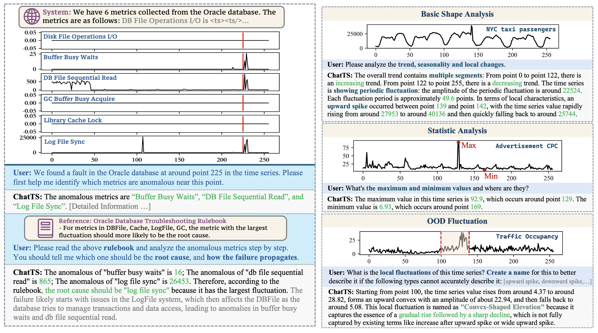

<div align="center">

# ChatTS: Time Series LLM for Understanding and Reasoning

[[🌐 **Web Demo**]](https://huggingface.co/spaces/xiezhe22/ChatTS) ·
[[🤗 **ChatTS-8B Model**]](https://huggingface.co/bytedance-research/ChatTS-8B) ·
[[🤗 **ChatTS-14B Model**]](https://huggingface.co/bytedance-research/ChatTS-14B) ·
[[📄 **Paper**]](https://www.vldb.org/pvldb/vol18/p2385-xie.pdf) ·
[[🌐 **Website**]](https://netmanaiops.github.io/ChatTS/)

[[🧰 **Training Scripts**]](https://github.com/xiezhe-24/ChatTS-Training) ·
[[📚 **Training Datasets**]](https://huggingface.co/datasets/ChatTSRepo/ChatTS-Training-Dataset) ·
[[🧪 **Evaluation Datasets**]](https://doi.org/10.5281/zenodo.14349206)

</div>

This repository provides official implementation of ChatTS, along with the training datasets and checkpoints for *[VLDB’25] paper: ChatTS: Aligning Time Series with LLMs via Synthetic Data for Enhanced Understanding and Reasoning*.
`ChatTS` is a Time Series Multimodal LLM (TS-MLLM) focused on **understanding** and **reasoning** over time series, just like vision/video/audio MLLMs, but **natively built for time series**. 


Check out the [Case Studies](#case-studies) section for more real-world applications and sample conversations.

---

## What ChatTS Does

* ✅ **Conversational understanding + reasoning:**
  Interactively explore structure, changes, and relationships across series.

* ✅ **Native multivariate support:**
  Works with multiple time series **of different lengths** and **flexible dimensionality** in one prompt.

* ✅ **Value-related QA:**
  ChatTS retains **raw numerical values** so the model can answer questions like
  *“How large is the spike at timestamp *t*?”*

* ✅ **Easy integration:**
  Plug into standard LLM pipelines; supports Transformers and vLLM (see the instructions below).

**Example application**
See `figures/chat_example.png` and the **Case Studies** section for real-world scenarios and conversation examples.

---

## News

* **2025/11/03**: We release the new [ChatTS-8B](https://huggingface.co/bytedance-research/ChatTS-8B) model for efficient training and deployment.
* **2025/10/23**: The [official website of ChatTS](https://netmanaiops.github.io/ChatTS/) launched.
* **2025/08/01**: `ChatTS-14B-0801` model launched with enhanced reasoning compability and Chinese support.
* **2025/07/24**: Web Demo launched on Hugging Face Spaces.
* **2025/07/03**: Released `ChatTS-14B-GPTQ-Int4` on Hugging Face.
* **2025/04/29**: Updated data generation code and released baseline implementations; see **Evaluation**.
* **2025/04/16**: ChatTS accepted by VLDB’25 and training datasets released.
* **2025/01/01**: New ChatTS release with enhanced CoT & QA capability.
* **2024/12/30**: Experimental vLLM support (KV cache & `AutoProcessor` enabled).

---

## Quick Start

### 1) Try It in the Browser (no install)
Use the Web Demo on Hugging Face Spaces:  
**👉 [ChatTS Web Demo](https://huggingface.co/spaces/xiezhe22/ChatTS)**  
You can upload your `.csv` file (example: `demo/ts_example.csv`) and chat with ChatTS-8B/14B about your data.

### 2) Install & Prepare
**Requirements (for inference):** `python==3.11` and `pip install -r requirements.txt`.  
**Hardware:** Use a GPU with sufficient memory for 8B or 14B LLMs and ensure your GPU supports Flash-Attention (e.g., A100/A800 are recommended).

**Steps**
1. **Download model weights**: Download any one of the following models and Unzip into `./ckpt/` (files like `ckpt/config.json`, etc.):
  - Choice 1: [ChatTS-8B on Hugging Face](https://huggingface.co/bytedance-research/ChatTS-8B)
  - Choice 2: [ChatTS-14B on Hugging Face](https://huggingface.co/bytedance-research/ChatTS-14B)
2. (**Optional for local evaluation**) Download evaluation datasets to `evaluation/dataset/`:  
   - `dataset_a.json`, `dataset_b.json` from [Zenodo](https://doi.org/10.5281/zenodo.14349206).

### 3) Deploy with Transformers
ChatTS supports **Value-Preserved Time Series Encoding** via `AutoProcessor` and an `sp` mask for variable-length batches.

```python
from transformers import AutoModelForCausalLM, AutoTokenizer, AutoProcessor
import torch
import numpy as np

# Load the model, tokenizer and processor
MODEL_PATH = "./ckpt"
model = AutoModelForCausalLM.from_pretrained(MODEL_PATH, trust_remote_code=True, device_map=0, torch_dtype='float16')
tokenizer = AutoTokenizer.from_pretrained(MODEL_PATH, trust_remote_code=True)
processor = AutoProcessor.from_pretrained(MODEL_PATH, trust_remote_code=True, tokenizer=tokenizer)
# Create time series and prompts
timeseries = np.sin(np.arange(256) / 10) * 5.0
timeseries[100:] -= 10.0
prompt = f"I have a time series length of 256: <ts><ts/>. Please analyze the local changes in this time series."
# Apply Chat Template
prompt = f"<|im_start|>system\nYou are a helpful assistant.<|im_end|>\n<|im_start|>user\n{prompt}<|im_end|>\n<|im_start|>assistant\n"
# Convert to tensor
inputs = processor(text=[prompt], timeseries=[timeseries], padding=True, return_tensors="pt")
# Move to GPU
inputs = {k: v.to(0) for k, v in inputs.items()}
# Model Generate
outputs = model.generate(**inputs, max_new_tokens=300)
print(tokenizer.decode(outputs[0][len(inputs['input_ids'][0]):], skip_special_tokens=True))
```

**Notes**

* Recommended time series length: **64–1024**; up to **30** series per input. Very short series (<64) may be less reliable (to be improved).
* See `demo/demo_hf.ipynb` for more examples.

### 4) vLLM Inference

`vLLM` does not natively ship ChatTS support. We provide a registration patch. Refer to [demo_vllm.py](demo/demo_vllm.py) for detailed usage.

Basic usage: Before loading with vLLM, **register ChatTS** with `chatts.vllm.chatts_vllm`:

```python
# (IMPORTANT) Make sure to import chatts_vllm
import chatts.vllm.chatts_vllm
from vllm import LLM, SamplingParams

MODEL_PATH = "./ckpt"
language_model = LLM(
    model=MODEL_PATH,
    trust_remote_code=True,
    max_model_len=6000,
    tensor_parallel_size=1,
    gpu_memory_utilization=0.95,
    limit_mm_per_prompt={"timeseries": 50}
)

ts_list = [...]  # list of np.ndarray time series
prompt = "...(chat template applied)..."

outputs = language_model.generate([{
  "prompt": prompt,
  "multi_modal_data": {"timeseries": ts_list}
}], sampling_params=SamplingParams(max_tokens=300))
```

**Note:** If you encounter problems when starting multiple workers with `vllm`, remember to use the environment variables: `VLLM_WORKER_MULTIPROC_METHOD=spawn VLLM_ALLOW_INSECURE_SERIALIZATION=1 python3 -m demo.demo_vllm`

### 5) OpenAI API-Compatible Server (vLLM)

You can deploy an OpenAI API–compatible server using vLLM:

* **(IMPORTANT)** Reinstall a modified vLLM build with the following command. Note that this will uninstall the previously installed vllm and PyTorch. You will be asked to input the path to the install location.
```sh
bash scripts/install_vllm_server.sh
```

* Start the server:

Example command to start serving (set the correct model path and port before starting the server):

```bash
bash scripts/start_vllm_server.sh
```

We provide a demo at [demo/vllm_api.py](demo/vllm_api.py) to show how to call the API for ChatTS.

---

## Training (Build Your Own)

We provide a full pipeline and **two modes** for generating data:

- Before data generation, set `local_llm_path` to the path of any local LLMs (`Qwen2.5-32B-Instruct` is recommended) in `config/datagen_config.yaml`.

### Data Generation Steps

1. **Alignment datasets**

   * Configure the backend, then run:

   ```bash
   bash scripts/generate_align_datasets.sh
   ```

2. **SFT datasets**

   * LLM-generated seed QAs:

   ```bash
   python3 -m chatts.sft.generate_llm_qa
   ```

   * **TSEvol** to expand datasets (supports local LLM or remote APIs):

   ```bash
   python3 -m chatts.sft.generate_tsevol_dataset
   ```

   * **IFT (Instruction-Following)** datasets (requires alignment labels first):

   ```bash
   python3 -m chatts.sft.generate_ift_dataset
   ```

**Sequence length**: configure `SEQ_LEN` in `config/datagen_config.yaml`. ChatTS commonly uses length **256** (we also mix other lengths via `seq_len=null`).

**Enhanced SFT**
(Optional) Scripts for diversified SFT data:

* `generate_uts_reason.py` (English univariate reasoning)
* `generate_uts_reason_cn.py` (Chinese univariate reasoning w/ consistency checks)
* `generate_mts_reason.py` (multivariate reasoning)
* `generate_rewrite_dataset.py` (augmentation by rewriting)

Run all at once:

```bash
bash scripts/generate_enhanced_sft_datasets.sh
```

### Model Training
Use **ChatTS-Training** (modified from LLaMA-Factory):
👉 [https://github.com/xiezhe-24/ChatTS-Training](https://github.com/xiezhe-24/ChatTS-Training) and refer to the steps in the README.

---

## Evaluation

### Step 1: Generate Inference Outputs

* **vLLM Inference**:

```bash
VLLM_WORKER_MULTIPROC_METHOD=spawn VLLM_ALLOW_INSECURE_SERIALIZATION=1 python3 -m chatts.utils.inference_tsmllm_vllm
```

Outputs are written under `exp/`.

### Step 2: Compute Metrics

* Install `ragas==0.1.9`.
* Set `API_KEY` and `OPENAI_URL` in `evaluation/ragas/config/config.toml`.
* Run:

```bash
python3 -m evaluation.evaluate_tsmllm_models
```

(We also include code to evaluate text/vision/agent LLM baselines; see `evaluation/` for details.)

---

## Time Series Generator

A user-friendly generator produces attribute pools and corresponding series.
See `demo/demo_ts_generator.ipynb`.

---

## Resource Links

| Resource                    | Link                                                                                                                                     | Description                   |
| --------------------------- | ---------------------------------------------------------------------------------------------------------------------------------------- | ----------------------------- |
| **Paper (VLDB’25)**         | [https://www.vldb.org/pvldb/vol18/p2385-xie.pdf](https://www.vldb.org/pvldb/vol18/p2385-xie.pdf)                                                                     | ChatTS paper                  |
| **ChatTS-8B-1103 Model** | [https://huggingface.co/bytedance-research/ChatTS-8B](https://huggingface.co/bytedance-research/ChatTS-8B)                             | Model weights                 |
| **ChatTS-14B-0801 Model** | [https://huggingface.co/bytedance-research/ChatTS-14B](https://huggingface.co/bytedance-research/ChatTS-14B)                             | Model weights                 |
| **ChatTS-8B-GPTQ-Int4**    | [https://huggingface.co/xiezhe24/ChatTS-8B-GPTQ-Int4](https://huggingface.co/xiezhe24/ChatTS-8B-GPTQ-Int4)                             | Quantized model               |
| **ChatTS-14B-GPTQ-Int4**    | [https://huggingface.co/xiezhe24/ChatTS-14B-GPTQ-Int4](https://huggingface.co/xiezhe24/ChatTS-14B-GPTQ-Int4)                             | Quantized model               |
| **Training Datasets**       | [https://huggingface.co/datasets/ChatTSRepo/ChatTS-Training-Dataset](https://huggingface.co/datasets/ChatTSRepo/ChatTS-Training-Dataset) | Synthetic training set        |
| **Evaluation Datasets**     | [https://doi.org/10.5281/zenodo.14349206](https://doi.org/10.5281/zenodo.14349206)                                                       | Real & synthetic eval data    |
| **Training Scripts**        | [https://github.com/xiezhe-24/ChatTS-Training](https://github.com/xiezhe-24/ChatTS-Training)                                             | Fine-tuning & data generation |

---

## Third-Party Dependencies

* Qwen ([https://github.com/QwenLM/Qwen2.5](https://github.com/QwenLM/Qwen2.5))
* DeepSpeed ([https://www.deepspeed.ai/](https://www.deepspeed.ai/))
* RAGAS ([https://github.com/explodinggradients/ragas](https://github.com/explodinggradients/ragas))
* vLLM ([https://github.com/vllm-project/vllm](https://github.com/vllm-project/vllm))
* Flash-Attention ([https://github.com/Dao-AILab/flash-attention](https://github.com/Dao-AILab/flash-attention))

---

## ChatTS Design

ChatTS is a TS-MLLM (Time Series Multimodal MLLM) built natively for Multivariate Time Series (MTS). ChatTS takes MTS and textual queries as input, first separating and processing each modality individually. The time series are split into fixed-size patches encoded via a time series encoder. The encoded time series patches are concatenated with text tokens at the token level based on their original input positions, preserving contextual relationships before being fed into the LLM for unified multimodal understanding and response generation.

---

## Evaluation

`ChatTS` achieves advantages over both text/vision (image)/agent-based LLMs, with up to 46–76% gains on categorical and 80–113% improvements on numerical alignment tasks compared with `GPT-4o`, while using much fewer tokens. With the native time series modality, ChatTS not only understands fine-grained temporal patterns more precisely, but also provides a far more efficient and scalable foundation for multimodal time-series analysis and reasoning.

---

## Case Studies

In `ChatTS`, we mainly focus on **Understanding and Reasoning** about time series, just like what vision/video/audio-MLLMs do, rather than conducting time series prediction, anomaly detection and classification tasks.
You can try more application scenarios of ChatTS by modifying the time series and the text of questions in `demo_hf.ipynb`! 

---

## Security

If you discover a potential security issue, please contact ByteDance Security via the [security center](https://security.bytedance.com/src) or email **[sec@bytedance.com](mailto:sec@bytedance.com)**.
**Do not** open public GitHub issues for vulnerabilities.

---

## License

This project is licensed under the **MIT License** (see `LICENSE`).

---

## Cite

```bibtex
@inproceedings{xie2025chatts,
  title={ChatTS: Aligning Time Series with LLMs via Synthetic Data for Enhanced Understanding and Reasoning},
  author={Xie, Zhe and Li, Zeyan and He, Xiao and Xu, Longlong and Wen, Xidao and Zhang, Tieying and Chen, Jianjun and Shi, Rui and Pei, Dan},
  booktitle={Proceedings of the VLDB Endowment, 2025},
  year={2025}
}
```

---

Please kindly give us a Star 🌟 if you like this repo!
